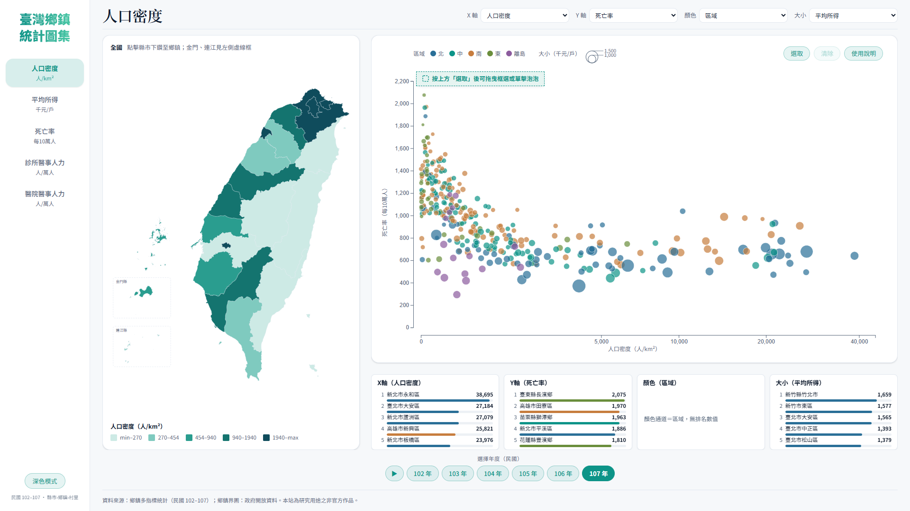
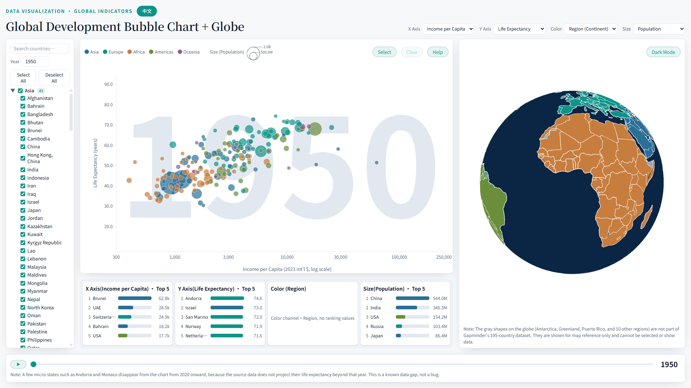
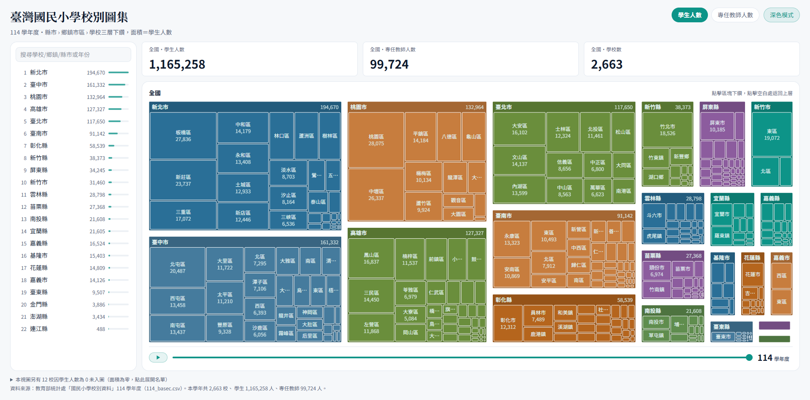
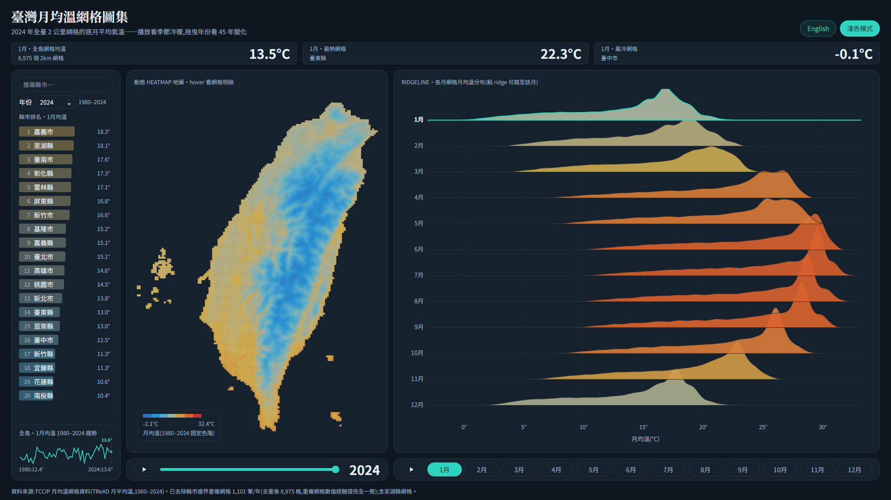

# Dataviz Coding Agent

本專案透過建構專屬 Claude Skill，提出將「資料與需求」轉化為「互動式視覺化應用」之標準化工作流程。本報告詳述該框架的設計邏輯，並展示四項實作部署成果。

- **中央研究院統計科學研究所 2026 年暑期實習成果彙整**
- **指導教授：** 顏佐榕 老師
- **研究實作：** 陳歆璇

## 實作成果展示

| **臺灣鄉鎮統計圖集** | **世界發展數據分析平台** |
| :---: | :---: |
| 
" alt="臺灣鄉鎮統計圖集" /> | 
" alt="世界發展數據分析平台" /> |
| https://township-drilldown-app.vercel.app/ | https://world-pulse-analytics.vercel.app/ |

| **臺灣國民小學校別圖集** | **臺灣月均溫網格圖集** |
| :---: | :---: |
| 
" />
" alt="臺灣國民小學校別圖集" /> | 
" /> |
| https://elementary-schools-treemap-app.vercel.app/ | https://temperature-grid-app.vercel.app/ |

<table>
<tr>
<td width="50%" align="center">
<b>📍 臺灣鄉鎮統計圖集</b>
<br><br>
<a href="https://township-drilldown-app.vercel.app"></a>
<br><br>
<a href="https://township-drilldown-app.vercel.app"></a>
</td>
<td width="50%" align="center">
<b>🌍 世界發展數據分析平台</b>
<br><br>
<a href="https://world-pulse-analytics.vercel.app"></a>
<br><br>
<a href="https://world-pulse-analytics.vercel.app"></a>
</td>
</tr>
</table>

<table>
<tr>
<td width="50%" align="center">
<b>🏫 臺灣國民小學校別圖集</b>
<br><br>
<a href="https://elementary-schools-treemap-app.vercel.app"></a>
<br><br>
<a href="https://elementary-schools-treemap-app.vercel.app"></a>
</td>
<td width="50%" align="center">
<b>🌡️ 臺灣月均溫網格圖集</b>
<br><br>
<a href="https://temperature-grid-app.vercel.app"></a>
<br><br>
<a href="https://temperature-grid-app.vercel.app"></a>
</td>
</tr>
</table>

🤖 **Skill 原始碼**：[`skill/data-vis-coding-v2/`](skill/data-vis-coding-v2/)

## 1. 研究動機（Motivation）

大型語言模型已能直接產生資料視覺化程式碼，但「一次性提示（one-shot prompt）」產出的視覺化應用普遍存在三類問題：

1. **看起來對、實際上錯**——資料錯置、視覺幻覺、統計偏誤（例如以「平均之平均」聚合比率指標）在畫面上不易察覺，型別檢查與單元測試也攔不到。
2. **視覺與互動品質難以自動驗證**——地圖投影糊掉、圖例被裁切、離島被畫到框外，這類「版面壞掉」的缺陷可以通過所有自動測試；人在迴圈（human-in-the-loop）該站在哪裡，才不會既漏掉真問題、又浪費在瑣事上？
3. **開發經驗如何固化為可攜、可累積的資產**——若每次視覺化開發都從零開始提示，經驗就無法累積。

本研究把「工作流程＋踩坑教訓」寫成一個結構化的 Claude Skill（`data-vis-coding-v2`），並反覆用它建構真實專案：如果經驗真的能複利，第二、第三、第四個專案應該一次比一次更快、更少踩重複的坑。四個獨立專案的建置時程，就是這個假設能否成立的直接證據（見 3.3 節）。

---

## 2. 成果（Results）

四個以同一個 skill 建置、資料型態與圖表型式互不相同的正式上線應用：

| 專案 | 資料 | 圖表 | 正式站 | 前端測試 | ETL 測試 |
|---|---|---|---|---|---|
| **臺灣鄉鎮統計圖集** | 鄉鎮多指標統計、十大死因、村里人口所得（政府開放資料） | 面量地圖三層下鑽＋四通道交叉篩選散布圖 | [township-drilldown-app.vercel.app](https://township-drilldown-app.vercel.app) | vitest ~142 項 + Playwright 十餘支 | ETL pytest 8 項 |
| **世界發展數據分析平台** | 195 國 1950–2019 人均所得／餘命／人口（仿 Gapminder） | D3 泡泡圖＋three.js／globe.gl 3D 面量地球儀 | [world-pulse-analytics.vercel.app](https://world-pulse-analytics.vercel.app) | vitest ~152 項 | — |
| **臺灣國民小學校別圖集** | 103–114 學年全臺約 2,700 所國小（教育部） | Zoomable treemap 三層下鑽＋年份播放 | [elementary-schools-treemap-app.vercel.app](https://elementary-schools-treemap-app.vercel.app) | vitest 33 項 | ETL pytest 54 項 |
| **臺灣月均溫網格圖集** | TCCIP TReAD 2km 網格月均溫，1980–2024（45 年） | 動態 heatmap 地圖＋ridgeline 分布圖 | [temperature-grid-app.vercel.app](https://temperature-grid-app.vercel.app) | vitest 15 項 | ETL pytest 9 項 |

建置它們的 skill 自身也是受測對象：`data-vis-coding-v2` 累積將近三十次「實戰中發現問題→通則化寫回 skill」的迭代，並以自身的 30 項 pytest 回歸測試與觸發評測（該出手時出手、不該出手時不誤觸）確保迭代不破壞既有內容。

<table>
<tr>
<td width="50%"><br><sub>臺灣鄉鎮統計圖集：地圖＋散布圖＋排名合併單頁</sub></td>
<td width="50%"><br><sub>世界發展數據分析平台：泡泡圖＋3D 面量地球儀</sub></td>
</tr>
</table>

<table>
<tr>
<td width="50%"><br><sub>國小校別圖集：三層 zoomable treemap</sub></td>
<td width="50%"><br><sub>月均溫網格圖集：heatmap 地圖＋ridgeline</sub></td>
</tr>
</table>

---

## 3. 方法／工作流程（Workflow）— skill 作為 coding agent

### 3.1　skill 做什麼

`data-vis-coding-v2` 引導 AI 走完 **規格釐清 → 資料處理 → 圖表選型 → 元件實作 → 多層次驗證**，核心是三個原則：

1. **內容與樣式分離**——先決定「畫什麼」，再套固定樣式字典決定「長怎樣」，避免每個專案的視覺語言各自漂移。
2. **執行取代臆測**——欄位、型別、統計量、圖形對應數值一律靠實際讀檔與執行取得，而非讓 AI 憑訓練資料的印象猜測，避免資料錯置與視覺幻覺。
3. **人機協作**——需求意圖與美學決策保留給人確認（先畫線框圖比稿、截圖回饋逐版修正），資料處理與實作驗證交給自動化。

v2 另外可一鍵 scaffold 專案骨架（純前端或全端、內建雙主題），並在動手前用 layout picker 先選版面。詳見 [`skill/data-vis-coding-v2/SKILL.md`](skill/data-vis-coding-v2/SKILL.md)。

### 3.2　開發管線

每個功能走固定管線：**brainstorming（需求與方案定案）→ spec（規格書存檔）→ plan（實作計畫）→ 測試驅動開發（TDD）→ 五層驗證（型別檢查、單元測試、資料校驗、Playwright 端對端、AI 審查與人工截圖審查）→ 使用者驗收 → 合併部署**。發現 bug 時不直接提供解法，而是提供截圖與重現步驟，由 AI 依 systematic-debugging 找出根因後修復，再把教訓通則化回寫至 skill。

**技術棧**：React 18＋TypeScript（Vite）、Tailwind CSS、D3 v7（四專案共用地圖投影／級距／補間／框選）、three.js＋globe.gl（地球儀專屬）、Python（pandas／pytest）或 Node.js 做 ETL、vitest＋Playwright 做前端驗證、GitHub＋Vercel 做版控與部署。

| AI／工具 | 角色 |
|---|---|
| Claude Code（Anthropic） | 唯一的編程 AI：需求釐清、規格與計畫撰寫、程式與測試實作、除錯、程式審查、部署、文件 |
| `data-vis-coding-v2`（自建 skill） | 疊加於 Claude Code 之上的視覺化領域知識與工作流程 |
| superpowers 系列 skill（社群） | 開發紀律：brainstorming／TDD／systematic-debugging／verification-before-completion |
| Google Gemini | 版面設計討論與線框圖草案，未參與程式撰寫 |
| ChatGPT | 開發環境疑難排解，未參與程式撰寫 |

### 3.3　複利的實證：四個專案的建置時程

| 專案 | 從動工到正式上線＋核心功能完整 |
|---|---|
| 臺灣鄉鎮統計圖集（第一個專案） | 約三週（7/2 首版地圖 → 7/24 完整驗證體系） |
| 世界發展數據分析平台（全新領域：跨國時間序列＋3D 地球儀） | 約四天（7/30 動工 → 8/3 上線） |
| 臺灣國民小學校別圖集（全新資料：教育部校別統計） | 一天內完成三輪需求閉環並上線 |
| 臺灣月均溫網格圖集（全新資料型態：45 年網格時序） | 一天內從零到完整動態版上線 |

每個新專案的資料型態、圖表型式都與前一個不同（理論上都應是「從零開始」的專案），但縮放數學、雙主題設計 tokens、Playwright 驗證模式、矮視窗降級處理、LCH 配色方法……皆是直接沿用前一個專案已收斂的解法，不重新踩坑。開發時程隨專案數量增加而遞減，是「skill 回寫是否真的會複利」這個研究問題最具體的正面答案。

---

## 4. 優點與限制（Advantages / Disadvantages）

**優點：**

1. **迭代速度**——單日可完成十輪以上「回饋、修正、全套驗證」循環，且每輪皆執行完整驗證，品質不隨速度衰減。
2. **驗證可累積**——可形式化的視覺不變量（幾何相交、島形落框、對比度、縮放錨點誤差、色階單調性）寫成常駐腳本，一次踩坑、永久設防。
3. **決策留痕**——brainstorming 紀錄、規格書、中文 commit 訊息構成完整決策鏈，任何「為什麼這樣做」均可回溯。
4. **經驗可攜且真實複利**——見 3.3 節時程證據；第四個專案的建置時間已壓縮到不到一天。

**缺點與限制——「自動測試全綠、仍由人工發現」的真實案例：**

| 案例 | 專案 | 缺陷 | 為何自動測試沒攔到 |
|---|---|---|---|
| 澎湖環繞方向 | 鄉鎮統計圖集 | 整張地圖渲染為單一色塊（面量圖畫成「全世界減去某地區」） | 環繞方向是幾何屬性，既有測試未斷言多邊形方向 |
| 對數軸縮放焦點漂移 | 世界發展數據分析平台 | 對數軸縮放時，游標定點數值隨縮放偏移 200px 以上 | 「縮放中維持線性刻度」與「游標定點」在對數軸上本質衝突，須實測才會發現 |
| 桃園縣／市跨年撞色 | 國小校別圖集 | 103 年桃園尚未升格為市，若以縣市代碼以外的欄位合併會被拆成兩種顏色 | 單一年份的單元測試看不出跨年一致性問題，需逐年播放人工比對才發現色彩跳動 |
| 網格解析度誤判 | 月均溫網格圖集 | 沿經緯軸分桶量測網格間距，量到比真實值大兩倍的錯誤結果 | TCCIP 網格相對經緯線有微小旋轉，只有改用最近鄰距離法才量得出正確解析度 |
| 多行 flex 版面撐爆 | 月均溫網格圖集 | 寬螢幕滿版鎖屏版面在特定寬度下被內容撐爆出捲軸 | `flexWrap` 多行版面的行高跟著內容走、不跟容器走，屬視覺密度問題，非既有斷言維度 |

**共同指向**：自動測試、AI 審查、人工目視三層各有盲區、缺一不可；「數學或邏輯正確，但視覺不可讀／不可信」類的缺陷，在四個專案中反覆以不同面貌出現，顯示這是資料視覺化領域的通用風險類型，而非個案巧合。

**與 AI 溝通之限制：**

1. 視覺需求難以用文字精確傳達，實務上依賴截圖標註與線框圖比稿。
2. AI 傾向接受使用者說法而非堅持技術判斷，需求提出者須主動要求 AI 提出反對意見與取捨。
3. 人的角色無法省略，但位置明確：極值情境的直覺、美感與語意判斷、對「畫面不對勁」的敏感度；人不寫程式碼，但站在驗收與異常偵測的位置。

---

## 5. 討論（Discussion）

**尚未完成的工作**：相關矩陣熱圖（死因×死因總覽）；skill 後續迭代候選（互動狀態矩陣檢查、線框圖比稿步驟正式入流程、對數軸縮放的通用檢查清單、3D／WebGL 情境的專屬驗證方法論）。

**未來方向**：四個正式案例已收斂出一套可重用的視覺化語彙（面量圖／zoomable 下鑽／交叉篩選散布圖／年份播放／雙主題＋中英雙語外殼），下一步可評估將此語彙抽象為 skill 中更明確的可重用元件層，而不只停留在教訓文字層級。

---

## Repo 結構

```
apps/
  township-drilldown-app/          臺灣鄉鎮統計圖集
  world-pulse-analytics/            世界發展數據分析平台
  elementary-schools-treemap-app/   臺灣國民小學校別圖集
  temperature-grid-app/             臺灣月均溫網格圖集
skill/
  data-vis-coding-v2/                建置以上四個 app 所依循的 Claude Skill
docs/
  screenshots/                       本頁使用的代表性截圖
```

每個 `apps/*/README.md` 保留該專案完整的功能清單、資料處理決策與開發指令；本頁只整理跨專案共通的研究敘事。各 app 皆可獨立 `npm install && npm run dev` 執行（ETL 輸出資料已隨 repo 附上，多數專案不需重跑 ETL 即可看到完整畫面）。

---

## 資料來源與致謝

- 臺灣鄉鎮統計圖集：政府開放資料（鄉鎮多指標統計、十大死因、村里人口所得）
- 世界發展數據分析平台：Gapminder 公開資料集（人均所得、平均餘命、人口）
- 國小校別圖集：教育部統計處「國民小學校別資料」（[data.gov.tw dataset 6240](https://data.gov.tw/dataset/6240)）
- 月均溫網格圖集：國家科學及技術委員會 TCCIP 計畫 TReAD 2km 網格資料

> **月均溫網格圖集資料授權說明**：本 repo 收錄的是 ETL 處理後的彙整輸出（去重、依縣市與月份聚合），並非 TCCIP 原始逐日網格檔；該資料原始授權條款是否允許以此形式公開散布，尚待向資料提供單位進一步確認。

感謝指導老師顏佐榕老師（中央研究院統計科學研究所）全程指導與逐項回饋；部分視覺化設計方法（調色盤生成邏輯、全端 scaffold 對照組）承蒙老師提供範例參考。

## AI 協助揭露

本 repo 內四個應用程式與 skill 皆由作者與 AI 協作完成：程式碼、測試與本文件由 Claude（Anthropic）依作者與指導教授的規格及回饋產生，作者負責需求釐清、設計決策、驗證與人工審查。
